# Smart Drip Irrigation: Aplikasi Mobile untuk Monitoring dan Kontrol Irigasi

Aplikasi Mobile untuk Project Capstone yang di desain dalam upaya monitoring dan kontrol irigasi di Greenhouse Telkom University.

## Table of Contents

- [Introduction](#introduction)
- [Features](#features)
- [Screenshots](#screenshots)
- [Tech Stack](#tech-stack)
- [Getting Started](#getting-started)
- [TODO List](#todo)

## Introduction

Smart Drip Irrigation adalah aplikasi mobile dengan tujuan untuk melakukan monitoring secara real-time dan juga melakukan kontrol irigasi di greenhouse. Aplikasi ini dirancang supaya mudah digunakan dan efisien, sehingga pengguna dapat memonitor tanaman, prediksi penggunaan air, dan optimisasi proses irigasi.

## Features

- Splash screen
- Menu awal
- Login 
- Signup (email/phone)
- Forgot Password
- Google Login
- Quick Info
- Monitoring real-time untuk irigasi tanaman
- Prediksi penggunaan irigasi
- Profile 

## Screenshots

| Splash Screen | Menu Awal | Login |
|---------------|------------|-------|
|  | 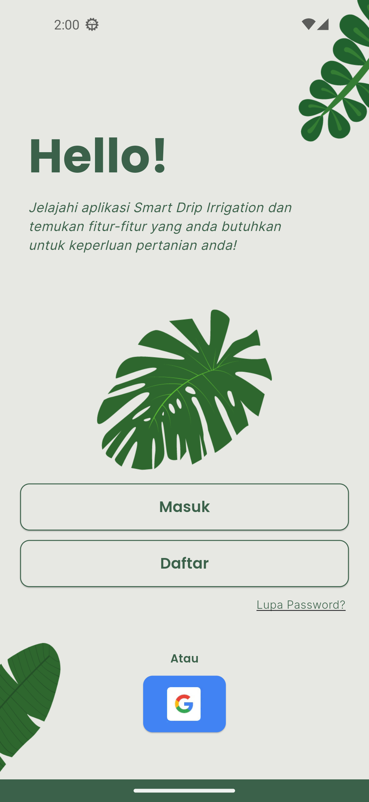 | 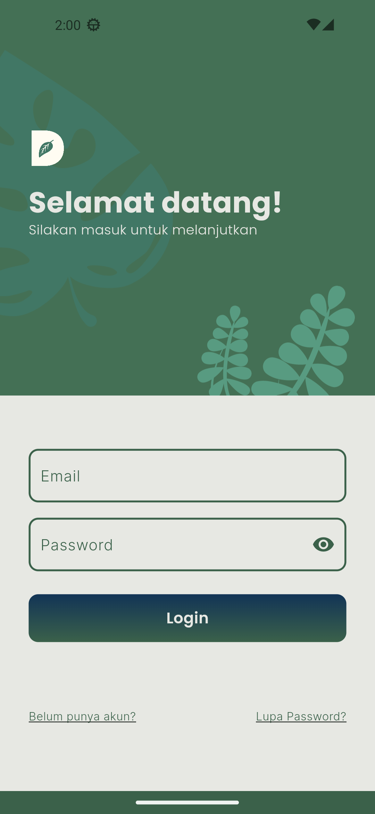 |

| Signup | Forgot Password | Quick Info |
|--------|-----------------|----------|
| 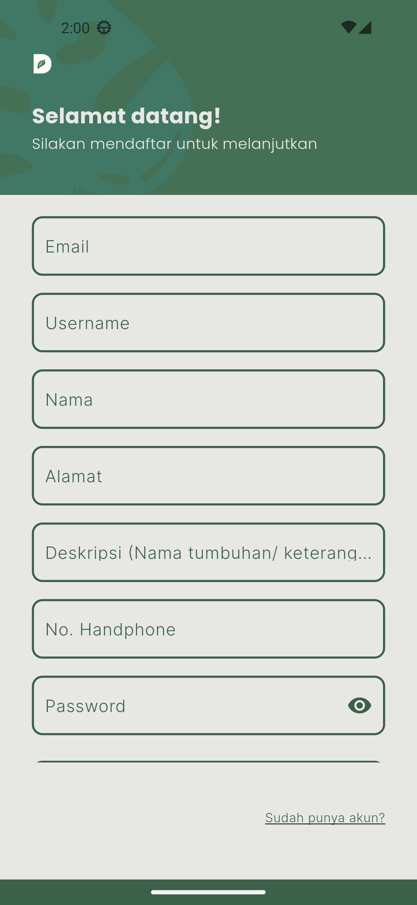 | 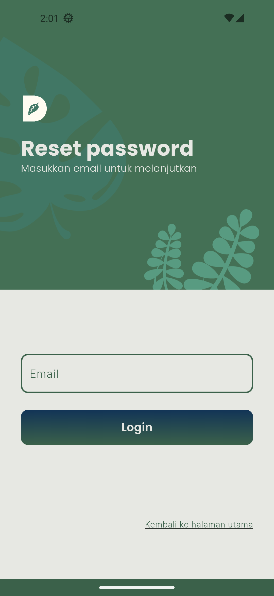 | 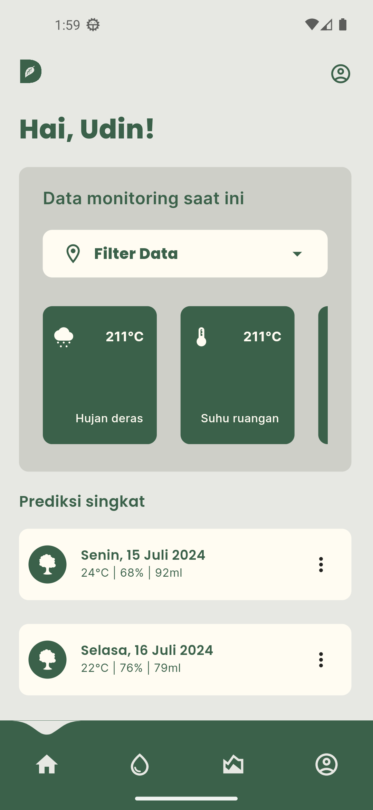 |

| OTP | OTP Forgot Password | Monitoring |
|--------|-----------------|----------|
| 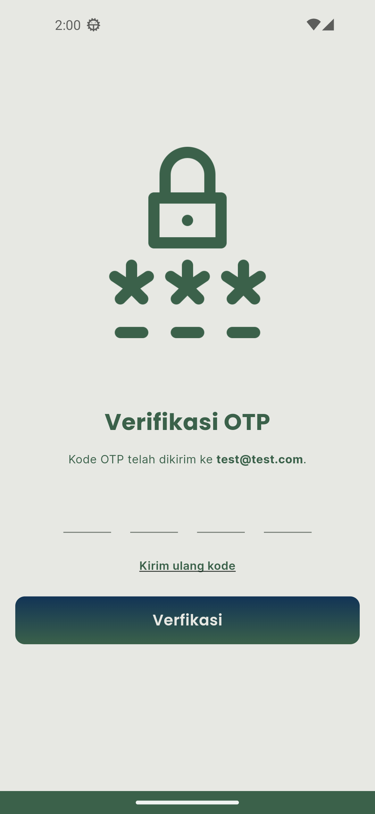 | 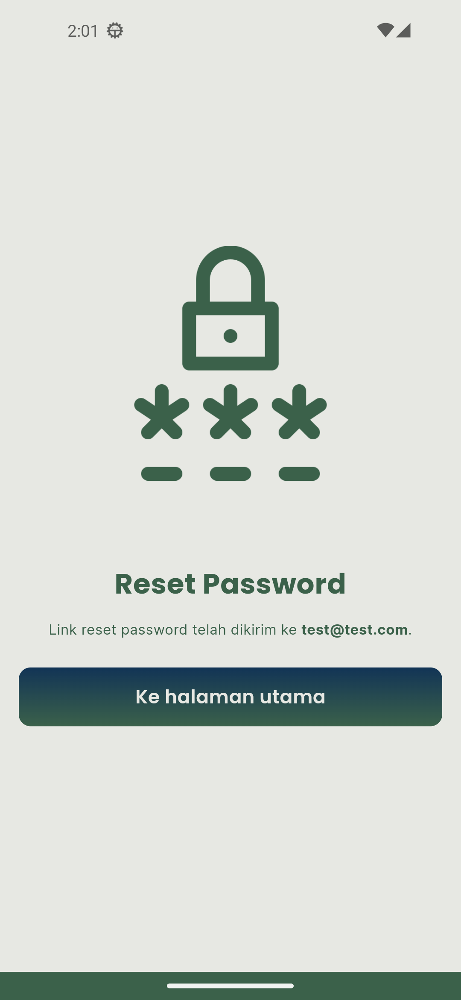 | 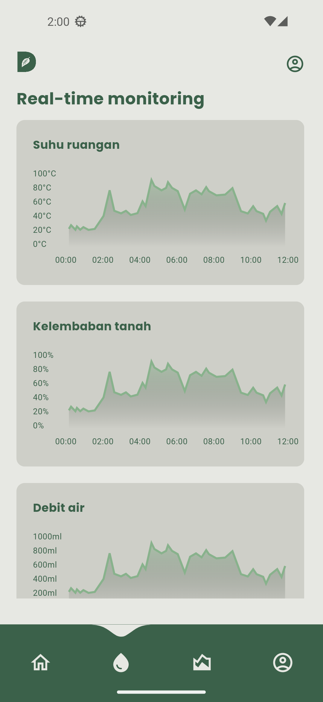 |

| Prediksi | Profile | Kontrol |
|--------|-----------------|----------|
| 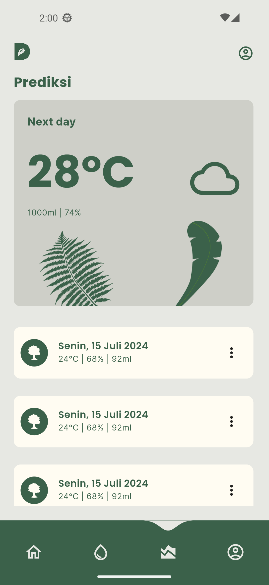 | 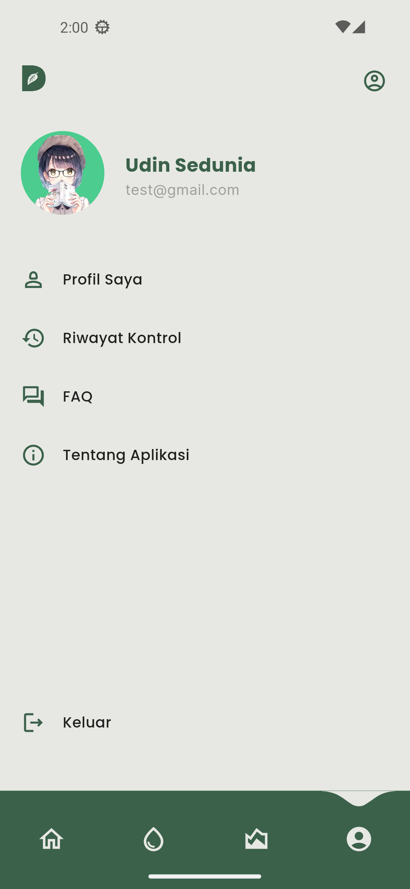 | 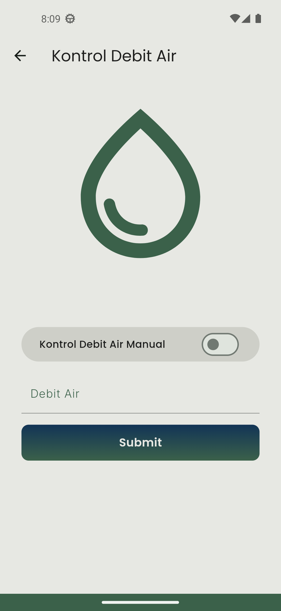 |

| My Profile | Riwayat Kontrol | FAQ |
|--------|-----------------|----------|
| 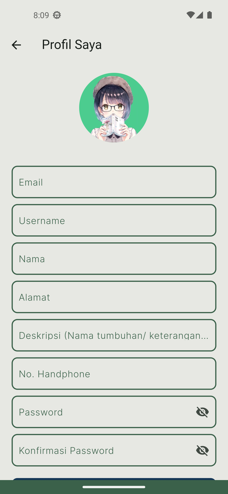 | 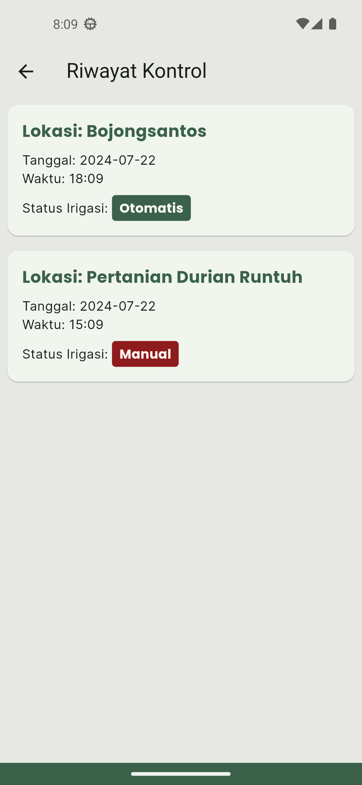 | 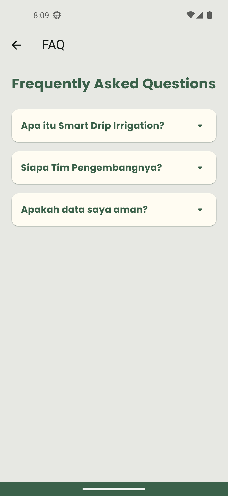 |

| About App |
|--------|
| 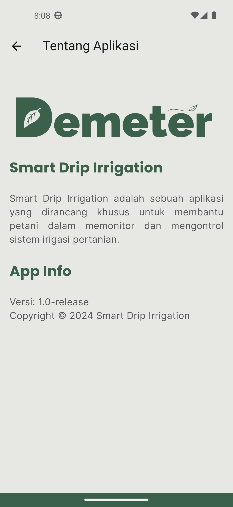 |

## Tech Stack

- Flutter (Frontend/Backend)
- Firebase (Authentication, Realtime Database)
- HTTPS (Hypertext Transfer Protocol Secure)

## Getting Started

Untuk memulai pengembangan proyek ini, lakukan hal dibawah:

1. Duplikat repository ini: `git clone https://github.com/udinnn/smart-drip-irrigation.git`
2. Install dependencies: `flutter pub get`
3. Konfigurasi pengaturan Firebase
4. Jalankan apliaksi: `flutter run DEVICENAME`

## TODO

- All of the backends
